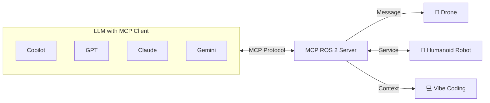
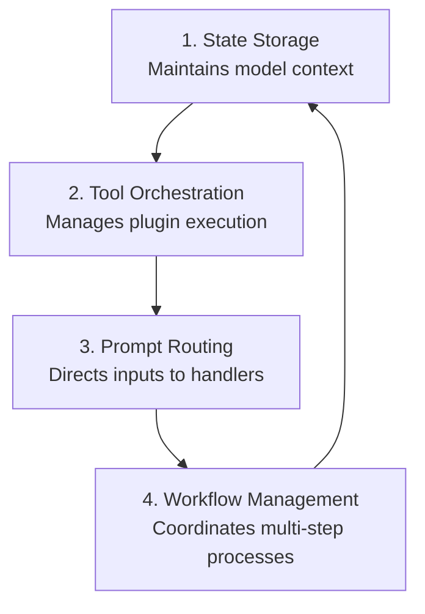
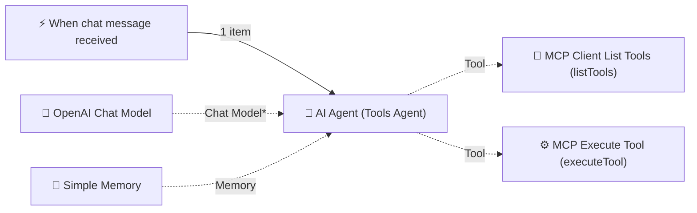
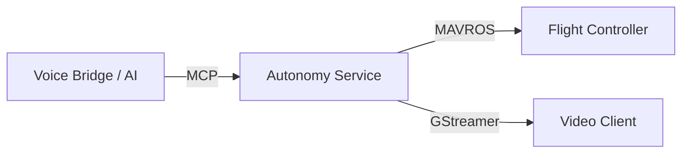

# Dial a Drone: Fly a Drone with a Phone Call
**Author:** Godfrey Nolan (godfrey@riis.com)  
**Event:** PX4 Developers Conference (May '26)  
**Source Document:** `Fly-Drone-with-a-Phone-Call.pdf` (32 Slides)

---

## Table of Contents
1. [Slide 1: Dial a Drone (Title Page)](#slide-1-dial-a-drone)
2. [Slide 2: Mission Accomplished](#slide-2-mission-accomplished)
3. [Slide 3: Architecture Overview](#slide-3-architecture-overview)
4. [Slide 4: Use Cases](#slide-4-use-cases)
5. [Slide 5: Architecture - OpenAI Realtime API with Twilio Quickstart](#slide-5-architecture---openai-realtime-api-with-twilio-quickstart)
6. [Slide 6: Architecture - End-to-End Pipeline Execution Flow](#slide-6-architecture---end-to-end-pipeline-execution-flow)
7. [Slide 7: System Prompt - Voice Bridge Drone Pilot Instructions](#slide-7-system-prompt---voice-bridge-drone-pilot-instructions)
8. [Slide 8: Architecture - MCP ROS 2 Server Ecosystem](#slide-8-architecture---mcp-ros-2-server-ecosystem)
9. [Slide 9: What is MCP? (Before vs After)](#slide-9-what-is-mcp-before-vs-after)
10. [Slide 10: Why MCP Matters](#slide-10-why-mcp-matters)
11. [Slide 11: MCP Server Backend Lifecycle](#slide-11-mcp-server-backend-lifecycle)
12. [Slide 12: Build Your Own MCP Server Steps](#slide-12-build-your-own-mcp-server-steps)
13. [Slide 13: Visual Workflow Orchestration (n8n MCP Agent)](#slide-13-visual-workflow-orchestration-n8n-mcp-agent)
14. [Slide 14: Client Implementation: Stdio Transport](#slide-14-client-implementation-stdio-transport)
15. [Slide 15: Client Implementation: SSE Transport](#slide-15-client-implementation-sse-transport)
16. [Slide 16: Technical Implementation Pillars](#slide-16-technical-implementation-pillars)
17. [Slide 17: Build Your Own MCP Server - Flight System Architecture](#slide-17-build-your-own-mcp-server---flight-system-architecture)
18. [Slide 18: Skills.py - Flight Skills & Capabilities Specification](#slide-18-skillspy---flight-skills--capabilities-specification)
19. [Slide 19: Server.py - FastMCP Server Specification](#slide-19-serverpy---fastmcp-server-specification)
20. [Slide 20: Video_streamer.py - Video Streaming Pipeline](#slide-20-video_streamerpy---video-streaming-pipeline)
21. [Slide 21: Architecture - Voice to Hardware Integration](#slide-21-architecture---voice-to-hardware-integration)
22. [Slide 22: Setup - Source Repositories](#slide-22-setup---source-repositories)
23. [Slide 23: Voice Configuration (.env)](#slide-23-voice-configuration-env)
24. [Slide 24: Autonomy Configuration (.env)](#slide-24-autonomy-configuration-env)
25. [Slide 25: Setup and Configuration Workflow](#slide-25-setup-and-configuration-workflow)
26. [Slide 26: System Launch & Execution Procedures](#slide-26-system-launch--execution-procedures)
27. [Slide 27: System Launch Overview](#slide-27-system-launch-overview)
28. [Slide 28: Troubleshooting](#slide-28-troubleshooting)
29. [Slide 29: Safety Considerations](#slide-29-safety-considerations)
30. [Slide 30: Challenges / Limitations](#slide-30-challenges--limitations)
31. [Slide 31: Future Improvements](#slide-31-future-improvements)
32. [Slide 32: Resources & Reference Links](#slide-32-resources--reference-links)

---

## Slide 1: Dial a Drone


### Visible Text
* **Title:** Dial a Drone
* **Conference:** PX4 Developers Conference May ‘26
* **Presenter:** Godfrey Nolan
* **Contact:** godfrey@riis.com

### Visual / Graphic Description
The right half of the slide shows an outdoor photograph of a male pilot standing on a high mountain ridge overlooking valleys and distant hills under a bright blue sky. The pilot is holding a smartphone directly up to his mouth, speaking into it, while a quadcopter drone hovers steadily in mid-air in front of him.

---

## Slide 2: Mission Accomplished


### Visible Text
* **Title:** Mission Accomplished

### Visual / Graphic Description
A real-world outdoor demonstration photograph captured on a building rooftop parking lot. A developer wearing a dark jacket is shown holding and looking down at a smartphone in his hands. Visible in the urban background are commercial city buildings (including a Chrysler office building), a perimeter chain-link fence, and outdoor drone ground equipment (telemetry radio / flight equipment) resting on the parapet ledge.

---

## Slide 3: Architecture Overview


### Visible Text
* **Header:** MEETUP
* **Title:** Fly a Drone with a Phone Call
* **Subtitle:** Using Twilio, an MCP and an LLM to control a drone with your voice.
* **Core Value Statement:** Speak naturally. AI understands. Drone takes action.
* **Drone Speech Bubble:** "Take off to 5 meters"

### Component Pipeline (Left to Right)
1. **Calling Interface:** Smartphone placing a cellular phone call to `+1 (548) 901-3901`
2. **Audio Stream:** Audio waveform transmitted over cellular network
3. **TWILIO (Voice Bridge):** Ingests phone call audio and bridges to WebSocket
4. **LLM (Understands Your Command):** Natural language reasoning and intent understanding
5. **MCP (Translates to Drone "Skills"):** AI-to-hardware interface mapping tool calls to robotic actions
6. **Quadcopter Drone:** Executes commands in physical space or simulation

### Technology Stack Mapping
| Layer | Technology | Primary Role |
| :--- | :--- | :--- |
| **Voice Ingestion** | Twilio | Voice & Webhooks |
| **Cognitive Engine** | LLM (OpenAI) | Reasoning & Natural Language Understanding |
| **Protocol / Bridge** | MCP (Model Context Protocol) | AI-to-Hardware Bridge |
| **Robotic Middleware** | ROS 2 | Autonomy & Safety Watchdogs |
| **Flight Stack & Sim** | Gazebo + PX4 | Simulation & Autopilot Flight Control |

### Architecture Flowchart (Mermaid)

```mermaid
graph LR
    Phone["📱 Phone Call<br/>+1 (548) 901-3901"] -->|"Audio Waveform"| Twilio["🔴 Twilio Voice Bridge<br/>(Voice & Webhooks)"]
    Twilio -->|"Audio Stream / Text"| LLM["🧠 LLM Engine<br/>(OpenAI Reasoning)"]
    LLM -->|"Tool Invocation"| MCP["⚡ MCP Protocol<br/>(AI-to-Hardware Bridge)"]
    MCP -->|"ROS 2 Actions"| ROS["🤖 ROS 2<br/>(Autonomy & Safety)"]
    ROS -->|"MAVROS / DDS"| PX4["🚁 Gazebo + PX4<br/>(Flight Control / Drone)"]
```


---

## Slide 4: Use Cases


### Visible Text & Structured Categories
* **Title:** Use Cases

1. **Search & Rescue** *(Icon: Helicopter/Drone)*
   * Deploying robots in dangerous or hard-to-reach environments to locate and assist survivors.
2. **Inspection** *(Icon: Document & Magnifying Glass)*
   * Industrial and infrastructure inspection using autonomous robotic systems.
3. **Military / Defense Simulations** *(Icon: Military Officer)*
   * Realistic defense training and simulation environments powered by robotics.
4. **Education & Robotics Training** *(Icon: Student with Graduation Cap)*
   * Hands-on learning experiences for students and professionals in robotics.
5. **Accessibility** *(Icon: Microphone)*
   * Voice-first robotics enabling greater independence for people with disabilities.

---

## Slide 5: Architecture - OpenAI Realtime API with Twilio Quickstart


### Visible Text
* **Repository Context:** `README` | `MIT license`
* **Title:** OpenAI Realtime API with Twilio Quickstart
* **Description:** Combine OpenAI's Realtime API and Twilio's phone calling capability to build an AI calling assistant.
* **Header Bar:** OpenAI Call Assistant | Documentation

### Web Application UI Breakdown (3-Column Layout)

#### Column 1: Session Configuration
* **Instructions Field:** `You are a helpful assistant in a phone call.`
* **Voice Selector:** `ash`
* **Tools Section:**
  * `get_weather` [Edit] [Delete]
  * `+ Add Tool` button
* **Action Button:** `Save Configuration`

#### Column 2: Live Call Session Transcript
* **Number Display:** `(888) 123-4567` | Status: `Setup Ready` | `Checklist`
* **Call Transcript Items:**
  * **Caller (4:57:41 PM):** "Hey, what weather in San Francisco?"
  * **AI Assistant (4:57:44 PM):** *Function call completed.*
  * **AI Assistant (4:57:50 PM):** "The weather in San Francisco is currently 77 degrees Fahrenheit."
  * **Caller (4:57:58 PM):** "Oh, nice. Thanks. And what about New York?"
  * **AI Assistant (4:58:00 PM):** *Function call completed.*
  * **AI Assistant (4:58:10 PM):** "In New York, it's currently 30 degrees Fahrenheit and snowing. Stay warm!"

#### Column 3: Function Calls Triggered
* **Card 1:** `get_weather` — Badge: `Completed`
  * Return Output: `77 f`
* **Card 2:** `get_weather` — Badge: `Completed`
  * Return Output: `30 and snowing`

---

## Slide 6: Architecture - End-to-End Pipeline Execution Flow


### Visible Text (Step-by-Step Flow)
```
Phone Call → Twilio → /media-stream (WebSocket)
                           ↓
               VoiceSession bridges audio to OpenAI
                           ↓
               OpenAI decides → function_call
                           ↓
               DockerMCPClient executes on ROS 2 drone
                           ↓
               Result fed back to OpenAI → spoken response → Twilio → Caller
```

### Execution Steps Breakdown
1. **Inbound Call:** Caller dials Twilio phone number.
2. **WebSocket Ingestion:** Twilio routes the audio call to `/media-stream` via bi-directional WebSocket.
3. **Session Bridging:** `VoiceSession` proxies audio bi-directionally between Twilio and OpenAI Realtime API.
4. **Intent & Function Calling:** OpenAI identifies user intent and yields a structured `function_call`.
5. **Drone Execution:** `DockerMCPClient` forwards tool arguments to the containerized ROS 2 drone agent.
6. **Voice Synthesis Feedback:** The tool return output is sent back to OpenAI; OpenAI synthesizes a spoken audio response and streams it back via Twilio to the caller's ear.

---

## Slide 7: System Prompt - Voice Bridge Drone Pilot Instructions


### Complete System Prompt Code
```python
SYSTEM_PROMPT = """
You are an expert Drone Pilot.
Your goal is to fly the drone safely and accurately based on user voice commands.
IMPORTANT: Always respond in English only. Never use any other language.

You have access to a suite of "Smart Skills" that handle the complex flight logic for you.
Do NOT try to fly the drone manually (e.g. do not calculate vectors yourself).
ALWAYS use the provided high-level tools.

### Available Skills:
- **Pre-Flight:** `preflight_check()` - Run before takeoff to verify FCU, GPS, battery.
- **Status:** `get_mode()`, `get_heading()`
- **Takeoff/Land:** `perform_takeoff(altitude)`, `perform_landing()`, `return_to_launch()`
- **Movement:** `move_relative(direction, distance)`, `set_altitude(height)`, `hold_position()`
  - direction must be one of: 'forward', 'backward', 'left', 'right', 'up', 'down'
- **Turning (relative):** `turn(degrees)` - Rotate relative to current heading. Positive = right/clockwise, Negative = left/counter-clockwise.
  - Example: "Turn right 90" -> `turn(90)`, "Turn around" -> `turn(180)`, "Turn left 45" -> `turn(-45)`
- **Heading (absolute):** `set_heading(angle)` - Face an exact compass bearing (0=N, 90=E, 180=S, 270=W).
  - Only use when the user specifies a compass direction (e.g. "face north", "heading 270").
- **Patterns:** `fly_pattern(pattern, radius)` - pattern is 'circle', 'square', or 'figure8'
- **Search:** `scan_area(width)`
- **Gimbal Control:** `set_gimbal(pitch, roll, yaw)` - Always set roll=0 unless explicitly asked.
  - Pitch: -90 (straight down) to 0 (horizon) to 30 (up)
  - Yaw: -180 to 180 (pan left/right relative to drone body)
  - Common positions: "nadir"/"look down" -> `set_gimbal(-90, 0, 0)`, "look forward" -> `set_gimbal(0, 0, 0)`, "pan left" -> `set_gimbal(0, 0, -90)`, "pan right" -> `set_gimbal(0, 0, 90)`
- **Vision:** `take_photo()` (Returns an image)
"""
```

---

## Slide 8: Architecture - MCP ROS 2 Server Ecosystem


### Visible Text & Topology Diagram
* **Title:** Architecture
* **Left Entity:** **LLM with MCP Client**
  * Supported Client Ecosystems: GitHub Copilot, OpenAI GPT, Anthropic Claude, Google Gemini
* **Transport Link:** `MCP Protocol`
* **Central Entity:** **MCP ROS 2 Server** (ROS logo)
* **Downstream Target Systems:**
  1. **Drone:** Communicates via ROS 2 `Message` topics
  2. **Robot (Humanoid):** Communicates via ROS 2 `Service` calls (bidirectional)
  3. **Vibe Coding:** Provides development & operational `Context`



---

## Slide 9: What is MCP? (Before vs After)


### Visible Text & Architectural Contrast
* **Title:** What is MCP?

#### Comparison Architecture
```
Before MCP:                               After MCP:
+-----------------------+                 +-----------------------+
|          LLM          |                 |          LLM          |
+---+-------+-------+---+                 +-----------+-----------+
    |       |       |                                 | (Unique API / MCP Client)
 Unique  Unique  Unique                               v
   API     API     API                    +-----------------------+
    |       |       |                     | Model Context Protocol|
    v       v       v                     |        (MCP)          |
+-----+  +----+  +------+                 +---+-------+-------+---+
|Slack|  | GD |  |GitHub|                     |       |       |
+-----+  +----+  +------+                  Unique  Unique  Unique
(N x M fragmented integrations)              API     API     API
                                              |       |       |
                                              v       v       v
                                           +-----+  +----+  +------+
                                           |Slack|  | GD |  |GitHub|
                                           +-----+  +----+  +------+
                                          (1 standardized protocol layer)
```

* **Core Takeaway:** Without MCP, every LLM requires custom, one-off connectors for every external tool. With MCP, the LLM connects to a unified protocol layer, allowing any model to plug-and-play with any external tool, database, or robotics server.

---

## Slide 10: Why MCP Matters


### Visible Text & Columns
* **Title:** Why MCP Matters

| Beyond Chatbots | Persistent Reasoning |
| :--- | :--- |
| • Autonomous execution of complex tasks | • Maintains context across sessions |
| • Self-correcting behavior | • Learns from previous interactions |
| • Multi-step reasoning | • Builds knowledge base over time |

---

## Slide 11: MCP Server Backend Lifecycle


### Visible Text & Circular Architecture
* **Title:** MCP Server Backend

The slide depicts a 4-stage circular orchestration engine:

1. **State Storage** *(Database icon)*
   * Maintains model context between interactions
2. **Tool Orchestration** *(Gear & Code icon)*
   * Manages plugin execution and integration
3. **Prompt Routing** *(Layout cards icon)*
   * Directs inputs to appropriate handlers
4. **Workflow Management** *(Hierarchy / Flowchart icon)*
   * Coordinates multi-step autonomous processes



---

## Slide 12: Build Your Own MCP Server Steps


### Visible Text & Staged Methodology
* **Title:** Build Your Own MCP Server

1. **Choose Your Stack:** Select frameworks and languages that fit your needs
2. **Implement Context Storage:** Build persistent memory with vector and relational systems
3. **Create Tool Interfaces:** Design flexible APIs for external tool access
4. **Define Agent Architecture:** Establish roles, communication patterns, and logic flows
5. **Integrate Model Backend:** Connect to LLM providers with prompting

---

## Slide 13: Visual Workflow Orchestration (n8n MCP Agent)


### Visual Diagram Description
The slide illustrates an automated agent pipeline built inside n8n:
* **Banner Graphic:** Futuristic AI neural mesh face.
* **Trigger Node:** `When chat message received` (emits 1 item)
* **Core Agent Node:** `AI Agent` (Tools Agent)
* **Peripheral Connections to AI Agent:**
  * **Chat Model:** `OpenAI Chat Model` (Model port, 3 items)
  * **Memory:** `Simple Memory` (Memory port, 2 items)
  * **Tool Port (Tool integrations):**
    1. `MCP Client List Tools` (`listTools`) — 1 item
    2. `MCP Execute Tool` (`executeTool`) — 1 item



---

## Slide 14: Client Implementation: Stdio Transport


### Visible Python Code
```python
async with MCPServerStdio(
    params={
        "command": "npx",
        "args": ["-y", "@modelcontextprotocol/server-filesystem", samples_dir],
    }
) as server:
    tools = await server.list_tools()
```

### Explanation
Demonstrates spawning an MCP server as a local child process using the `stdio` transport. The client executes `npx -y @modelcontextprotocol/server-filesystem` and queries available tools dynamically over standard input/output.

---

## Slide 15: Client Implementation: SSE Transport


### Visible Python Code
```python
async def main():
    async with MCPServerSse(
        name="SSE Python Server",
        params={
            "url": "http://localhost:8000/sse",
        },
    ) as server:
        trace_id = gen_trace_id()
        with trace(workflow_name="SSE Example", trace_id=trace_id):
            print(f"View trace: https://platform.openai.com/traces/trace?trace_id={trace_id}\n")
            await run(server)
```

### Explanation
Demonstrates connecting to a remote or standalone MCP server via Server-Sent Events (SSE) over HTTP (`http://localhost:8000/sse`), including telemetry tracing integration with OpenAI platform traces.

---

## Slide 16: Technical Implementation Pillars


### Visible Text & Features
* **Title:** Technical Implementation
* **Header Graphic:** Developer working at dual displays inspecting code.
* **Key Components:**
  1. **API Endpoints** *(Plug icon)*
     * WebSockets for real-time or HTTP for RESTful
  2. **Vector Stores** *(Coordinates icon)*
     * Efficient semantic search capabilities
  3. **Persistent Storage** *(Database icon)*
     * Database-backed memory with query optimization

---

## Slide 17: Build Your Own MCP Server - Flight System Architecture


### Visible Architecture Block Diagram
* **Title:** Build Your Own MCP Server



### Component Roles
* **Voice Bridge / AI:** Handles audio ingestion, speech recognition, and LLM reasoning.
* **MCP:** Low-latency protocol link translating function calls into microservice actions.
* **Autonomy Service:** Containerized Python ROS 2 service exposing high-level flight skills.
* **MAVROS:** Translates ROS 2 commands into MAVLink packets for the autopilot hardware.
* **Flight Controller:** PX4 autopilot governing physical motors, sensors, and actuators.
* **GStreamer:** Zero-latency UDP video pipeline streaming real-time drone camera feed to video clients.

---

## Slide 18: Skills.py - Flight Skills & Capabilities Specification


### Visible Text & Structured Skills Table
* **Title:** Skills.py
* **Table Header:** Flight Skills / Capabilities

| Skill | Description |
| :--- | :--- |
| `preflight_check` | Validates FCU connection, GPS fix, and battery before flight |
| `perform_takeoff` | Streams setpoints → switches to `OFFBOARD` → arms → ascends |
| `perform_landing` / `return_to_launch` | Switches to `AUTO.LAND` or `AUTO.RTL` |
| `hold_position` | Re-engages `OFFBOARD` at current position |
| `set_altitude` / `set_heading` | Smooth altitude/yaw changes |
| `move_relative` | Body-frame relative movement (`forward`/`back`/`left`/`right`/`up`/`down`) with heading-aware coordinate rotation |
| `fly_pattern` | Executes circle, square, or figure-8 flight patterns |
| `scan_area` | Lawnmower search pattern over a square area |
| `take_photo` | Captures and returns a base64-encoded JPEG from the camera feed |
| `set_gimbal` | Controls gimbal pitch/roll/yaw via MAVROS `MountControl` |

---

## Slide 19: Server.py - FastMCP Server Specification


### Visible Text & FastMCP Architecture Table
* **Title:** Server.py

| Category | Detail |
| :--- | :--- |
| **Framework** | `FastMCP` — initializes a server named `"SmartDroneAgent"` |
| **Core Dependency** | `DroneSkills` — global instance that handles all actual drone logic |
| **System Resource** | `Status://system` — reports the drone's current operational status |
| **Telemetry Tools** | `get_mode`, `get_heading`, `get_telemetry` |
| **Pre-flight Tools** | `preflight_check` |
| **Flight Control Tools** | `perform_takeoff`, `perform_landing`, `return_to_launch`, `hold_position` |
| **Movement Tools** | `set_altitude`, `set_heading`, `turn`, `move_relative` |
| **Pattern Tools** | `fly_pattern` (circle, figure-8, square), `scan_area` (lawnmower search) |
| **Camera Tools** | `take_photo`, `set_gimbal` |
| **Guard Pattern** | Every tool checks `if not skills` before executing, returning a safe error string if uninitialized |
| **Logic** | Server is a thin wrapper — delegates almost all logic to `DroneSkills`, except `turn()` which computes a new absolute heading locally |
| **Transport** | Runs over `stdio`, making it suitable as a subprocess for an LLM host |
| **Entry Point** | `main()` instantiates `DroneSkills` and starts the MCP server |

---

## Slide 20: Video_streamer.py - Video Streaming Pipeline


### Visible Text & Video Pipeline Specification Table
* **Title:** Video_streamer.py

| Responsibility | Details |
| :--- | :--- |
| **ROS 2 Subscription** | Subscribes to `/camera/image_raw` using a sensor-data QoS profile (best-effort), compatible with Gazebo/simulation environments |
| **Image Conversion** | Uses `cv_bridge` to convert incoming ROS `Image` messages to OpenCV (`bgr8`) frames |
| **GStreamer Streaming** | Encodes frames via H.264 (`x264enc`) with zero-latency tuning and streams over UDP via RTP (`rtph264pay` → `udpsink`) |
| **Lazy Initialization** | The `cv2.VideoWriter` is initialized on the first frame so resolution is inferred automatically at runtime |
| **Configurable Target** | Stream host and port are ROS 2 parameters (defaulting to `127.0.0.1:5600`), making it easy to retarget without code changes |
| **Clean Shutdown** | `destroy_node()` releases the `VideoWriter` before calling the parent shutdown, preventing resource leaks |

---

## Slide 21: Architecture - Voice to Hardware Integration


### Visible Text & System Recapitulation
* **Title:** Architecture
* **Meetup Context:** Fly a Drone with a Phone Call — Using Twilio, an MCP and an LLM to control a drone with your voice.
* **Motto:** Speak naturally. AI understands. Drone takes action.
* **Pipeline Summary:**
  * Twilio handles telephony voice stream.
  * LLM executes cognitive reasoning and determines flight actions.
  * FastMCP server translates high-level functions to ROS 2 actions.
  * ROS 2 autonomy layer interfaces to PX4 autopilot via MAVROS.

---

## Slide 22: Setup - Source Repositories


### Visible Shell Commands
```bash
git clone https://github.com/godfreynolan/voice-bridge
git clone https://github.com/godfreynolan/autonomy-service
git clone https://github.com/PX4/PX4-Autopilot --recursive
```

---

## Slide 23: Voice Configuration (.env)


### Visible Text (`voice-bridge/.env`)
```ini
OPENAI_API_KEY=""
DRONE_CONTAINER_NAME=autonomy-service
PORT=8080
TWILIO_ACCOUNT_SID=""
TWILIO_AUTH_TOKEN=""
TWILIO_PHONE_NUMBER=""
NGROK_AUTH_TOKEN=""
```

---

## Slide 24: Autonomy Configuration (.env)


### Visible Text (`autonomy-service/.env`)
```ini
SIMULATION_MODE=true
MAVROS_FCU_URL=udp://:14540@host.docker.internal:14580
ENABLE_VIDEO=true
PX4_GZ_WORLD=default
GZ_MODEL_NAME=x500_gimbal_0
ROS_DOMAIN_ID=0
VIDEO_HOST=host.docker.internal
VIDEO_PORT=5600
```

---

## Slide 25: Setup and Configuration Workflow


### Visible Code Boxes & Configuration Steps

#### 1. Clone Repositories
```bash
mkdir drone-project
cd drone-project

# Get core services
git clone .../autonomy-service
git clone .../voice-bridge

# Recursive PX4 clone
git clone https://github.com/PX4/PX4-Autopilot.git --recursive
cd PX4-Autopilot
```

#### 2. Configure Keys
* **a) Edit `voice-bridge/.env`:**
```ini
OPENAI_API_KEY=sk-...
DRONE_CONTAINER_NAME=autonomy-service
PORT=8080
TWILIO_ACCOUNT_SID=AC...
TWILIO_AUTH_TOKEN=...
TWILIO_PHONE_NUMBER=...
NGROK_AUTH_TOKEN=...
```

* **b) Edit `autonomy-service/.env`:**
```ini
SIMULATION_MODE=true
MAVROS_FCU_URL=udp://:14540@host.docker.internal:14580
ENABLE_VIDEO=true
PX4_GZ_WORLD=default
GZ_MODEL_NAME=x500_gimbal_0
ROS_DOMAIN_ID=0
VIDEO_HOST=host.docker.internal
VIDEO_PORT=5600
```

#### 3. Install Voice Bridge
```bash
cd voice-bridge

# Create python virtual environment
python3 -m venv .venv
.\myenv\Scripts\activate   # Windows PowerShell / CMD
# (or source .venv/bin/activate on Linux/macOS)

# Install dependencies
pip install -r requirements.txt
```

---

## Slide 26: System Launch & Execution Procedures


### Visible Text & Command Execution Sequence

#### Step 1: Autonomy Service
```bash
cd autonomy-service
docker compose up
```

#### Step 2: Simulator
```bash
cd PX4-Autopilot
make px4_sitl gz_x500_gimbal
```

#### Step 3: Ground Control Safety Link
> ⚠️ **Open QGroundControl** first to establish link.

* *If additional background world is needed in simulation, run:*
```bash
make px4_sitl gz_x500_baylands
```

#### Step 4: Run Voice Bridge
```bash
cd voice-bridge
source .venv/bin/activate
python main.py
```

#### Step 5: Call your Twilio number
**Commands to Try:**
* `"Take off to 5 meters"`
* `"Move forward 10m"`
* `"Turn right 90 deg"`
* `"Land"`

---

## Slide 27: System Launch Overview


### Visible Content Description
A screen capture of Google Slides presenting the "Voice-controlled-drone-setup" presentation deck.
The slide under view highlights the three primary deployment stages:
1. **Clone Repositories:** "Ensures all microservices and the flight stack are in one workspace."
2. **Configure Keys:** Environment variable configuration for both `voice-bridge` and `autonomy-service`.
3. **Install Voice Bridge:** "Sets up the Python environment for voice ingestion and GPT-4o proxying."

---

## Slide 28: Troubleshooting


### Visible Problem & Solution Cards

| Issue | Resolution |
| :--- | :--- |
| ⚠️ **Drone won't arm?** | Open **QGroundControl** first to establish the telemetry link before issuing arming commands. |
| ⚙️ **Slow first PX4 build** | This is normal; CMake compiles the entire SITL targets from source on first run. Subsequent builds are fast. |
| 🌐 **Ngrok URL changes** | Add a permanent auth token to config. If auto tunneling fails, manually execute in terminal: `ngrok http 8000`. |
| 🐳 **Docker slow first run** | Expected behavior while pulling base ROS 2 and simulator container images. |

---

## Slide 29: Safety Considerations


### Visible Text & Operational Guidelines
* **Title:** Safety Considerations
* **Key Principles:**
  * **Add command validation layer:** Validate tool inputs against spatial limits before sending commands to MAVROS.
  * **Enforce geofencing:** Restrict maximum distance, altitude, and operational flight boundaries.
  * **Require confirmations for risky actions:** Trigger explicit verbal confirmation before executing critical commands (e.g., motor shutoff, return to home).
  * **Implement emergency stop:** Hardware and software kill-switch failsafes override any AI instruction.

---

## Slide 30: Challenges / Limitations


### Visible Text & Technical Constraints
* **Title:** Challenges / Limitations
* **Key Points:**
  * **Latency (voice → AI → execution):** Round-trip delay through telephony, speech-to-text, LLM inference, and network hops.
  * **Reliability of speech recognition:** Accents, wind/propeller noise, background interference affecting transcription.
  * **Safety constraints (AI hallucination risk):** Model interpreting invalid commands or hallucinating parameters outside flight envelopes.
  * **Network dependency (Twilio + ngrok):** Reliance on cloud webhooks, public endpoints, and stable internet connectivity.

---

## Slide 31: Future Improvements


### Visible Text & Roadmap Items
* **Title:** Future Improvements
* **Key Roadmap Items:**
  * ➔ **Multi-drone coordination:** Swarm flight control from unified natural voice instructions.
  * ➔ **Visual feedback loop (camera + AI):** Multi-modal vision feedback loop to inform flight decisions.
  * ➔ **Edge AI (remove cloud dependency):** Local small language models running on companion computers to eliminate cloud latency.
  * ➔ **Mobile app / Landline:** Native mobile client interfaces and legacy landline support.
  * ➔ **Autonomous mission planning:** Generating complex multi-waypoint missions on the fly.

---

## Slide 32: Resources & Reference Links


### Visible Links & Documentation
* **OpenAI Voice Agents Cookbook:**  
  `https://cookbook.openai.com/examples/agents_sdk/app_assistant_voice_agents`
* **OpenAI Realtime Twilio Demo:**  
  `https://github.com/openai/openai-realtime-twilio-demo`
* **Wise Vision ROS 2 MCP:**  
  `https://github.com/wise-vision/ros2_mcp`
* **Godfrey Nolan Voice Bridge Repository:**  
  `https://github.com/godfreynolan/voice-bridge`
* **Godfrey Nolan Autonomy Service Repository:**  
  `https://github.com/godfreynolan/autonomy-service`
* **OpenAI Playground:**  
  `https://platform.openai.com/playground`
* **Drone Software Meetup Group:**  
  `https://meetup.com/drone-software-meetup-group`
