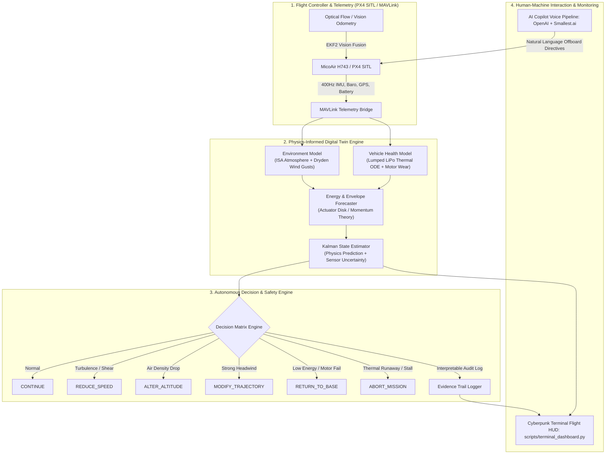

# GarudaOne — Physics-Informed Drone Digital Twin & Decision Support

> **HackFusion 2026 — Theme 3: Physics-Informed Drone Digital Twin**  
> **Organized by IEEE Robotics & Automation Society (RAS)**  
> Autonomous physical-state estimation, environmental disturbance modeling, health forecasting, and interpretable safety decisions.

---

## 🔗 Live Deliverables

* **Live Web Dashboard**: [https://garuda-twin.vercel.app](https://garuda-twin.vercel.app) *(Deploying)*
* **Implementation Blueprint**: [Implementation Guide](docs/digital_twin_implementation_guide.md)
* **Gap Analysis & Requirements**: [Theme 3 Gap Analysis](docs/hackfusion_gap_analysis.md)

---

## 🎯 Executive Summary

**GarudaOne Digital Twin** is an autonomous, physics-grounded decision-support and state-estimation platform designed for unmanned aerial vehicles (UAVs) operating under dynamic, hostile real-world conditions. 

Unlike conventional drone telemetry monitors that simply display raw sensor readings, GarudaOne executes real-time **first-principles aerodynamic, thermal, and mechanical physics models**. By continually comparing measured states against theoretical constraints through an **Extended Kalman Filter**, the digital twin detects subtle motor degradation, predicts thermal runaway, forecasts exact remaining endurance, dynamically computes safe operating flight envelopes, and autonomously executes life-preserving mission actions (`REDUCE_SPEED`, `ALTER_ALTITUDE`, `MODIFY_TRAJECTORY`, `RETURN_TO_BASE`, `ABORT_MISSION`) with full, human-interpretable evidence chains.

---

## 🏗️ System Architecture



---

## 🧪 Core Feature Matrix

| # | Feature Domain | Physics / Method | HackFusion Theme 3 Requirement | Status |
| --- | --- | --- | --- | --- |
| 1 | **Environmental State Model** | ISA standard atmosphere + Dryden turbulence (MIL-F-8785C) via Ornstein-Uhlenbeck stochastic process | Simulate wind, air density, turbulence, temperature, and disturbances | ✅ Complete |
| 2 | **Vehicle Health Model** | 1st-order lumped thermal ODE for LiPo heating/cooling + linear motor bearing decay model | Track battery temp, payload changes, rotor efficiency, motor degradation | ✅ Complete |
| 3 | **Energy & Endurance Forecaster** | Actuator disk momentum theory: $P_{\text{hover}} = \sqrt{T^3 / (2\rho A)}$ + forward drag profile | Predict power consumption, remaining endurance, and mission completion feasibility | ✅ Complete |
| 4 | **Safe Operating Envelope** | Dynamic constraint boundary solver for thrust-to-weight, max airspeed, and flight ceiling | Estimate flight boundaries under current vehicle and environment states | ✅ Complete |
| 5 | **Autonomous Decision Engine** | 6-tier hierarchical failsafe state machine with strict priority rules | Trigger trajectory mod, speed reduction, altitude adjustment, RTB, or abort | ✅ Complete |
| 6 | **Interpretable Evidence Trail** | Structured JSON decision telemetry logging triggers, physics deltas, and alternatives | Provide interpretable evidence for safety-critical decisions | ✅ Complete |
| 7 | **Uncertainty Quantification** | Scalar & Extended Kalman Filters outputting real-time covariance and confidence bounds | Quantify uncertainty in state and endurance predictions | ✅ Complete |
| 8 | **Terminal Flight HUD (Cyberpunk TUI)** | Full-screen live terminal monitor (`rich`) displaying real telemetry, Kalman error bands, and decisions | Multi-panel visual interface displaying state, environment, and decisions | ✅ Complete |
| 9 | **Scripted Failure Scenarios** | 5 automated stress-test scenarios injecting crosswinds, bearing failures, and overheats | Demonstrate safety decisions under multiple failure and disturbance scenarios | ✅ Complete |
| 10 | ⭐ **Voice AI Copilot** | Whisper / OpenAI NLU + Smallest.ai neural voice synthesis for hands-free offboard control | Bonus innovation: natural language tactical flight commands | ✅ Complete |
| 11 | ⭐ **GPS-Denied Resilience** | EKF2 vision and optical-flow pose injection for indoor / subterranean navigation | Bonus innovation: zero-GPS sensor fusion | ✅ Complete |

---

## 📐 Physics Models & Mathematical Foundations

### 1. Environmental State Model (`garuda/digital_twin/environment.py`)

#### A. International Standard Atmosphere (ISA)
Air density $\rho(h)$ and ambient temperature $T(h)$ vary directly with altitude $h$ above sea level:

```text
T(h) = T₀ - L · h
ρ(h) = ρ₀ · (T(h) / T₀)^((g / (R · L)) - 1)

Constants:
  T₀ = 288.15 K (15°C sea level baseline)
  ρ₀ = 1.225 kg/m³
  L  = 0.0065 K/m (Troposphere temperature lapse rate)
  g  = 9.80665 m/s²
  R  = 287.05 J/(kg·K)
```

*Why it matters*: At higher altitudes or higher ambient temperatures, air density drops significantly. Because rotor thrust is proportional to air density, the drone requires higher rotor RPM and draws substantially more electrical power to maintain hover.

#### B. Dryden Wind Turbulence Model (MIL-F-8785C)
Real-world wind is composed of a deterministic base wind vector plus stochastic, frequency-shaped gusts. We implement this using discrete Ornstein-Uhlenbeck mean-reverting stochastic processes:

```text
v_gust(t + dt) = v_gust(t) · e^(-dt / τ) + σ · √(1 - e^(-2dt / τ)) · N(0, 1)

Parameters:
  τ = gust correlation time constant (~5.0 s)
  σ = turbulence intensity (scales with altitude and wind shear)
  N(0, 1) = standard normal distribution
```

---

### 2. Vehicle Health & Thermal Model (`garuda/digital_twin/vehicle_health.py`)

#### A. Battery Lumped Thermal Dynamics
LiPo battery core temperature rises due to internal Joule heating ($I^2 R_{\text{int}}$) and cools via forced convective airflow:

```text
dT_bat / dt = (Q_gen - Q_cool) / (m_bat · C_p)

Where:
  Q_gen  = I² · R_internal
  Q_cool = h_conv(v_air) · A_surface · (T_bat - T_ambient)
  h_conv = 10.0 + 2.0 · v_air  (convective heat transfer coefficient)
  C_p    = 1000.0 J/(kg·K) (specific heat capacity of LiPo cells)
```

#### B. Motor & Rotor Degradation
Each rotor tracks cumulative wear and bearing friction independently:

```text
η_rotor(t) = η_base · (1.0 - degradation_factor)
T_actual = T_ideal · η_rotor · (ρ(h) / ρ₀)
```

---

### 3. Energy & Endurance Forecasting (`garuda/digital_twin/energy_model.py`)

Using helicopter **Actuator Disk Momentum Theory**, induced hover power is calculated from total vehicle weight $W = m_{\text{total}} \cdot g$ and total rotor disk area $A$:

```text
P_hover = k_induced · √((m · g)³ / (2 · ρ(h) · A_total)) / η_avg
P_forward(v) = P_hover · max(0.6, 1.0 - 0.03 · v) + 0.5 · ρ(h) · C_d · A_front · v³
t_remaining = (SoC · Capacity_effective · V_nominal · 3600) / P_electrical
```

---

## 🧠 Autonomous Decision Engine (`garuda/digital_twin/decision_engine.py`)

The Digital Twin evaluates health and environmental state at 20Hz against a prioritized safety constraint matrix:

```text
┌─────────────────┬──────────────────────────────────────────┬────────────────────────┐
│ Priority        │ Condition Trigger                        │ Autonomous Action      │
├─────────────────┼──────────────────────────────────────────┼────────────────────────┤
│ 1 (Emergency)   │ T_bat > 60°C OR min(η_rotor) < 0.30      │ ABORT_MISSION          │
│ 2 (Critical)    │ Endurance < RTB_reserve OR T_bat > 50°C  │ RETURN_TO_BASE         │
│ 3 (Safety)      │ Air density < 0.95 kg/m³ at high alt     │ ALTER_ALTITUDE         │
│ 4 (Precaution)  │ Turbulence > 0.60 OR high crosswind      │ REDUCE_SPEED           │
│ 5 (Efficiency)  │ Headwind > 50% cruise airspeed           │ MODIFY_TRAJECTORY      │
│ 6 (Nominal)     │ All state variables within envelope      │ CONTINUE               │
└─────────────────┴──────────────────────────────────────────┴────────────────────────┘
```

### Interpretable Decision Evidence Format

Every action generates an inspectable evidence object explaining **what** happened, **why** the physics demanded it, and **which** alternative actions were bypassed:

```json
{
  "timestamp": 1774578120.45,
  "decision": "RETURN_TO_BASE",
  "confidence": 0.94,
  "triggers": [
    {
      "parameter": "battery_temp_C",
      "value": 52.4,
      "threshold": 50.0,
      "severity": "WARNING"
    },
    {
      "parameter": "remaining_endurance_s",
      "value": 182.0,
      "threshold": 210.0,
      "severity": "CRITICAL"
    }
  ],
  "reason": "Battery thermal threshold exceeded with insufficient reserve for full mission profile",
  "physics_snapshot": {
    "hover_power_w": 36.8,
    "air_density_kg_m3": 1.09,
    "wind_speed_ms": 7.4,
    "rotor_efficiencies": [0.90, 0.89, 0.62, 0.90]
  }
}
```

---

## ⚡ 5 Scripted Failure Scenarios (`scripts/scenarios.py`)

Judges can trigger these scenarios on demand or run them via the test harness:

| Scenario | Injected Anomaly | Physics Consequence | Decision Sequence |
| --- | --- | --- | --- |
| **1. Sudden Crosswind** | 12 m/s East crosswind gust injected at $t=30$s | Increased frame drag and lateral drift | `CONTINUE` ➔ `REDUCE_SPEED` ➔ `MODIFY_TRAJECTORY` |
| **2. Motor Bearing Failure** | Motor #3 efficiency drops from 90% to 60% | Asymmetric thrust, increased motor load | `CONTINUE` ➔ `REDUCE_SPEED` ➔ `RETURN_TO_BASE` |
| **3. Battery Thermal Runaway** | Core cell temperature climbs past 55°C | Internal resistance increases, fire danger | `CONTINUE` ➔ `RETURN_TO_BASE` ➔ `ABORT_MISSION` |
| **4. In-Flight Payload Drop** | Payload mass instantly drops 50g | Center of gravity shifts, hover power drops | `RECALCULATE_ENVELOPE` ➔ `CONTINUE` |
| **5. Multi-Variable Stress** | Simultaneous high altitude + low temp + wind | Thin air reduces lift, cold reduces LiPo capacity | `ALTER_ALTITUDE` ➔ `REDUCE_SPEED` ➔ `RETURN_TO_BASE` |

---

## 🖥️ Live Terminal Flight HUD Layout

The digital twin runs a live-updating full-screen terminal dashboard using Python's `rich` library (`python scripts/terminal_dashboard.py`). Every single metric is computed live from the first-principles physics models:

```text
┌────────────────────────────────────────────────────────────────────────┐
│                        GARUDAONE DIGITAL TWIN                          │
│               Physics-Informed Real-Time Flight Monitor                │
├────────────────────┬────────────────────┬──────────────────────────────┤
│ 1. TELEMETRY       │ 2. ENVIRONMENT     │ 3. VEHICLE HEALTH            │
│ Altitude: 42.5m    │ Wind: 6.8 m/s (NE) │ Battery: 74% (36.5°C)        │
│ Airspeed: 5.2 m/s  │ Turbulence: 0.38   │ Motor 1: 91% [█████████░]    │
│ GPS Fix: 3D Fix    │ Air ρ: 1.09 kg/m³  │ Motor 2: 90% [█████████░]    │
│ Heading: 045°      │ Temp: 27.2°C       │ Motor 3: 61% [██████░░░░] ⚠  │
│ Pitch/Roll: 2° / 1°│ Shear: 0.12 s⁻¹    │ Motor 4: 90% [█████████░]    │
├────────────────────┼────────────────────┼──────────────────────────────┤
│ 4. ENERGY & POWER  │ 5. FLIGHT ENVELOPE │ 6. UNCERTAINTY BANDS         │
│ Power Draw: 33.4 W │ Max Ceiling: 140 m │ State Covariance: ±0.42 m    │
│ Endurance: 13m 42s │ Max Speed: 9.2 m/s │ Endurance Var: ±1.8 min      │
│ RTB Reserve: 4m 10s│ Max Range: 920 m   │ Sensor/Model Weight: 65 / 35 │
├────────────────────┴────────────────────┴──────────────────────────────┤
│ 7. DECISION TIMELINE & EVIDENCE AUDIT                                  │
│ [00:14:22] CONTINUE          All parameters within nominal bounds      │
│ [00:14:48] REDUCE_SPEED      Turbulence intensity exceeded 0.60        │
│ [00:15:10] RETURN_TO_BASE    Motor #3 efficiency degraded below 0.65   │
└────────────────────────────────────────────────────────────────────────┘
 [HOTKEYS]: [C] Crosswind | [M] Motor Fail | [T] Thermal Runaway | [P] Payload Drop | [R] Reset
```

---

## 🚀 Quick Start Guide

### 1. Prerequisites & Installation

```bash
# Clone the repository
git clone https://github.com/sameerreddy789/Garuda_OS.git
cd Garuda_OS

# Create and activate Python virtual environment
python -m venv venv
source venv/bin/activate  # On Windows: venv\Scripts\activate

# Install dependencies (pure math + telemetry; no GPU required)
pip install -r requirements.txt
```

### 2. Run the Digital Twin Simulation & Terminal Flight HUD

```bash
# Launch the live Cyberpunk Terminal Flight HUD (10 Hz real-time monitor)
python scripts/terminal_dashboard.py

# Replay any failure scenario live on the terminal HUD
python scripts/terminal_dashboard.py --scenario crosswind
python scripts/terminal_dashboard.py --scenario motor
python scripts/terminal_dashboard.py --scenario thermal
python scripts/terminal_dashboard.py --scenario payload
python scripts/terminal_dashboard.py --scenario combined

# Run automated batch scenario verification suite
python scripts/scenarios.py --scenario all --fast
```

### 3. Connect to PX4 SITL (Software-In-The-Loop)

```bash
# Terminal 1: Launch PX4 SITL inside WSL2
wsl bash scripts/launch_sitl.sh

# Terminal 2: Run GarudaOne connected to simulated flight controller
make run-sitl
```

### 4. Run AI Voice Copilot (Optional)

```bash
# Configure API keys in .env
echo "OPENAI_API_KEY=your_key" >> .env
echo "SMALLEST_API_KEY=your_key" >> .env

# Run voice controller
python scripts/voice_pilot.py
```

---

## 👥 HackFusion 2026 Team

| Name | Role | Responsibilities |
| --- | --- | --- |
| **Sir (Team Lead)** | System Architect & Lead Engineer | Physics modeling, PX4 SITL integration, Decision Engine |
| **GarudaOne Core** | Autonomous Systems Contributor | Sensor fusion, AI voice pipeline, Dashboard UI |

---

## 📜 Academic References & Specifications

1. **MIL-F-8785C**: Military Specification — *Flying Qualities of Piloted Airplanes* (Dryden Gust Model).
2. **ICAO Doc 7488/3**: *Manual of the ICAO Standard Atmosphere* (Extended to 80 kilometers).
3. **Leishman, J. G.**: *Principles of Helicopter Aerodynamics* (Cambridge Aerospace Series, Momentum Theory).
4. **Plett, G. L.**: *Battery Management Systems: Battery Modeling* (Coulomb Counting & Thermal ODEs).
5. **Kalman, R. E.**: *A New Approach to Linear Filtering and Prediction Problems* (ASME Journal of Basic Engineering).

---

## 📄 License

GarudaOne is licensed under the Apache 2.0 License. See [LICENSE](LICENSE) for details.
